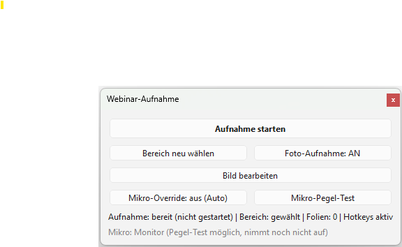
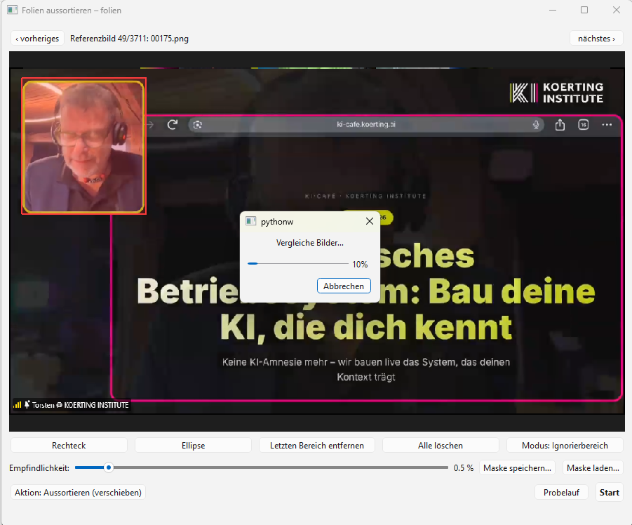

# Webinar Recorder

Ein Windows-Tool zum Mitschneiden von Live-Webinaren: Es nimmt den **Ton durchgehend**
auf, fotografiert den **Folienbereich aber nur einmal pro Sekunde** und speichert ein Bild
nur dann, wenn sich die Folie tatsächlich geändert hat. So kann man in Ruhe zuhören,
statt parallel mitschreiben zu müssen – und die Datenmenge bleibt klein.

> Hinweis: Nur für eigene Aufzeichnungen im rechtlich zulässigen Rahmen verwenden
> (Einwilligung der Beteiligten, Urheber- und Datenschutzrecht beachten).

## Screenshots

| Aufnahme-Steuerung | Folien aussortieren |
| --- | --- |
|  |  |

Weitere Screenshots im Ordner [`images/`](images): Nachbearbeitung
(`Postprocessing.png`) und das manuelle Aussortieren im Explorer
(`ManualRemoveInExplorer_1.png`, `ManualRemoveInExplorer_2.png`).

## Funktionen

- **Durchgehende Tonaufnahme**: System-Ton (WASAPI-Loopback) + Mikrofon.
- **Folien als Serienfotos**: 1 Bild/Sekunde, gespeichert nur bei echter Änderung
  (Vergleich auf ~320 px herunterskaliert, robust gegen Kompressionsrauschen).
- **Aufnahmebereich frei wählbar** und während der Aufnahme umstellbar; Foto-Aufnahme
  an/aus (z. B. bei Gruppendiskussionen ohne Folien).
- **Mikrofon** wird sprachgesteuert in Segmente aufgenommen (kein riesiger Stille-Track),
  mit Pegel-Test, Geräteauswahl (umgeht „Stereomix"/Loopback) und manuellem Override.
- **Bild bearbeiten**: aktuelle Folie einfrieren und mit Textmarker/Stift/Text
  annotieren (Farbauswahl pro Werkzeug), unabhängig von der weiterlaufenden Aufnahme.
- **Lautstärke-Angleichung** beim Speichern (EBU R128, stille-gegatet) plus
  Lautstärkeregler im Player.
- **Player**: System-Ton als Taktgeber, Mikro-Segmente synchron eingemischt, passende
  Folie zu jedem Zeitpunkt.
- **Folien aussortieren**: nachträgliches Entdoppeln großer Bildmengen – Sprecher-Bereich
  (Rechteck oder Ellipse) ignorieren, Duplikate verschieben oder löschen.

## Voraussetzungen

- Windows 10/11
- Python 3.10+ (wird vom Setup bei Bedarf via winget installiert)
- FFmpeg (für MP3 + Lautstärke-Angleichung; wird vom Setup via winget installiert)

## Installation

1. Dieses Repository herunterladen (grüner **Code**-Knopf → *Download ZIP*) oder klonen:
   ```
   git clone https://github.com/OlafDrechsler/webinar-recorder.git
   ```
2. In den Ordner wechseln und **`Setup.bat` per Doppelklick** ausführen.
   Das installiert die Python-Pakete, FFmpeg und legt die Verknüpfungen an
   („Webinar Aufnahme", „Webinar Player", „Folien aussortieren").

## Benutzung

- **Aufnahme**: „Webinar Aufnahme" starten → Speicherort wählen → Fenster zur Seite
  schieben → Aufnahmebereich wählen → **Aufnahme starten**. Zum Schluss **Aufnahme
  beenden** (dann werden die Dateien zu MP3 umgewandelt und in der Lautstärke angeglichen).
- **Wiedergabe**: „Webinar Player" → Aufnahme-Ordner wählen.
- **Aussortieren**: „Folien aussortieren" → Folienordner wählen → Sprecher-Bereich
  markieren → Probelauf → verschieben oder löschen.

Alternativ ohne Verknüpfung:
```
python app.py          # Aufnahme
python player\play.py  # Wiedergabe
python sortout.py      # Folien aussortieren
```

## Wie es funktioniert (kurz)

- **Synchronität**: Ein stiller „Keepalive"-Ausgabestream hält die Audio-Engine aktiv,
  damit der Loopback ab Aufnahmestart lückenlos liefert – sonst begänne der System-Ton
  erst beim ersten Geräusch und alles wäre zeitversetzt.
- **Dateinamen**: Folien und Mikro-Segmente sind mit der Sekunde seit Aufnahmestart
  benannt, sodass der Player alles korrekt zusammensetzt.
- **Aussortieren**: Vergleich gegen das zuletzt *behaltene* Bild, nur außerhalb des
  ignorierten Sprecher-Bereichs; das erste Bild eines identischen Laufs bleibt immer.

## Tests

Reine Logik (ohne Hardware/GUI) ist mit pytest abgedeckt:
```
python -m pytest -q
```

## Lizenz

Veröffentlicht unter der **GNU General Public License v3.0** – siehe [LICENSE](LICENSE).

Copyright (C) 2026 Olaf Drechsler
